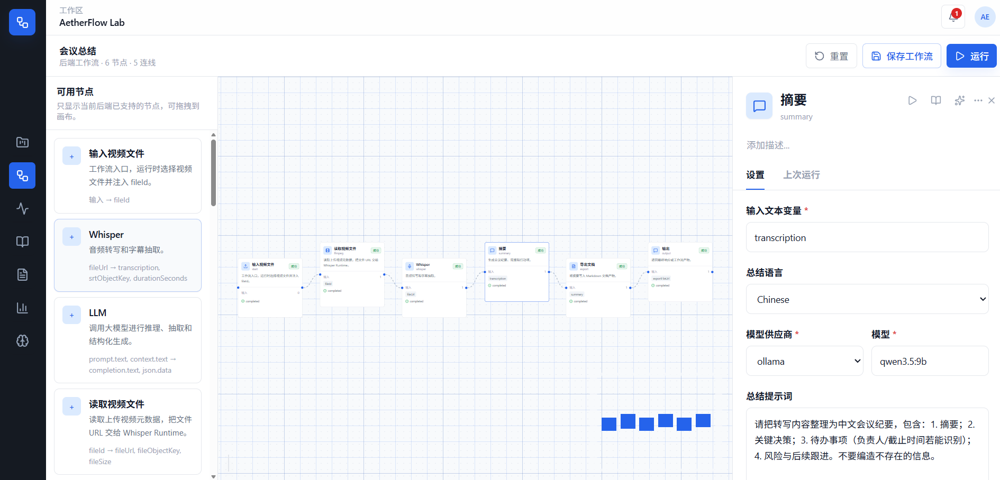

# AetherFlow

> 企业级 AI 工作流自动化平台，把文件、模型、提示词、外部工具和通知能力编排成可复用的 DAG 流水线。

[English](README.en.md) | [架构说明](Architect.md) | [Common 契约](docs/COMMON_CONTRACTS.md) | [项目结构](docs/PROJECT_STRUCTURE.md)


## 这是什么

AetherFlow 面向企业内部的 AI 自动化场景：用户在前端拖拽 DAG 工作流，把上传文件、OCR、转录、摘要、翻译、模型调用、数据处理、任务通知等节点串成可追踪、可复用、可扩展的流水线。

它不是单个聊天机器人，也不是简单的脚本集合。AetherFlow 更像一个 AI-native 的业务编排层：前端负责可视化设计和运行观察，后端微服务负责认证、文件治理、工作流定义、任务调度、AI 能力编排和实时通知，Python 服务负责更贴近模型与媒体处理的推理适配。

## 项目预览



## 核心能力

| 能力 | 说明 |
| --- | --- |
| 可视化 DAG 编排 | 基于 Vue Flow 构建工作流画布，支持节点化组织文件、模型、提示词和工具调用。 |
| 文件治理 | 文件上传、分片上传、MinIO 对象存储、元数据管理、派生文件记录和缓存治理。 |
| AI 任务调度 | Java 微服务负责运行态编排，RabbitMQ 承接异步任务，Python AI 服务适配模型与媒体处理。 |
| 实时反馈 | 通过 WebSocket / SSE 推送工作流运行状态、节点进度和错误信息。 |
| 企业基础设施 | Spring Cloud Gateway、Nacos、Sentinel、Seata、Redis、MySQL、RabbitMQ、MinIO 组成服务底座。 |
| 可部署入口 | Nginx 承载前端静态资源，并统一代理 `/api`、`/ws`、`/sse` 到网关。 |

## 典型场景

- 文档处理：上传 PDF、Word、合同或报告，自动提取正文、生成摘要、翻译润色、抽取结构化字段，并导出 Markdown、表格或审阅结果。
- OCR 识别：处理扫描件、票据、证照和图片资料，完成文字识别、版面解析、表格还原、字段校验、人工复核流转和入库归档。
- 会议与音视频处理：上传会议录音或视频，提取音频、Whisper 转录、生成纪要与待办、润色字幕、生成 SRT，并推送进度。
- AI 视频生成：从主题、文案或脚本出发，编排提示词生成、分镜拆分、图片/视频模型调用、素材合成、转码压制、审核和发布通知。
- 报表自动化：导入 Excel、CSV 或业务数据，进行清洗、分类、汇总分析、图表生成、报告撰写和定时分发。
- 知识库加工：批量导入文档资料，执行切分、摘要、标签生成、向量化、质检和检索问答数据准备。

## 架构速览

```text
                    +----------------------+
                    |      Web Console     |
                    | Vue 3 + Vue Flow     |
                    +----------+-----------+
                               |
                        Nginx / Gateway
                               |
        +----------------------+----------------------+
        |                      |                      |
  auth-service          workflow-service       notify-service
  JWT / OAuth           DAG definitions        WebSocket / SSE
        |                      |                      |
        +-----------+----------+-----------+----------+
                    |                      |
              file-service            task-service
        MinIO / metadata / cache       RabbitMQ tasks
                    |                      |
                    +----------+-----------+
                               |
                           ai-service
                 provider orchestration / node runtime
                               |
                       python-ai-service
             Whisper / OCR / media / model adapters
```

核心运行链路：

```text
用户上传文件、素材或提交工作流参数
-> file-service 存储 MinIO 对象与元数据
-> workflow-service 创建工作流实例并解析 DAG
-> task-service 记录任务并投递 RabbitMQ
-> ai-service 消费任务并按节点类型调用 python-ai-service、模型供应商或外部工具
-> file-service 保存派生文件与结构化结果元数据
-> notify-service 通过 WebSocket/SSE 推送状态
```

## 技术栈

| 层级 | 技术 |
| --- | --- |
| 后端 | Java 17, Maven, Spring Boot 3.2.12, Spring Cloud 2023.0.5, Spring Cloud Alibaba 2023.0.3.3 |
| 微服务治理 | Gateway, Nacos, OpenFeign, Sentinel, Seata, Springdoc OpenAPI / Swagger |
| 数据与中间件 | MyBatis Plus, MySQL 8.0.26, Redis, RabbitMQ, MinIO, XXL-Job, Activiti BPM |
| AI 与媒体 | Spring AI, FastAPI, OpenAI SDK, Ollama SDK, faster-whisper, ctranslate2, torch, ffmpeg-python, pydub |
| 前端 | Vue 3, Vue Router 5, Pinia, Vite 8, TypeScript, Tailwind CSS, Vue Flow, Orval, lucide-vue-next |
| 部署 | Docker Compose, Nginx, WebSocket, SSE |

## 目录结构

```text
backend/
  common/                 # 统一响应、错误码、JWT、MQ Event、DTO 和 OpenAPI 契约
  gateway-service/        # API 网关
  auth-service/           # 认证与用户身份
  workflow-service/       # 工作流定义与实例
  task-service/           # 任务记录与消息投递
  ai-service/             # AI 节点编排与供应商调用
  file-service/           # 文件、对象存储与元数据治理
  notify-service/         # WebSocket / SSE 通知
  workflow-runtime-api/   # 工作流运行时契约
frontend/                 # Vue 3 工作台
python-ai-service/        # Python AI 推理与媒体处理服务
ai-runtime/               # Windows 本机演示 runtime
docker/                   # 基础设施配置
performance-test/         # JMeter 性能测试脚本
docs/                     # 契约、部署、任务和架构文档
docker-compose.yml
```

## 快速启动

### 环境要求

- JDK 17
- Maven 3.9+
- Node.js 20+
- Docker Desktop / Docker Engine

### 本地构建

```powershell
$env:JAVA_HOME = 'C:\Program Files\Microsoft\jdk-17.0.19.10-hotspot'
$env:Path = "$env:JAVA_HOME\bin;$env:Path"
mvn test
```

前端构建：

```powershell
cd frontend
npm install
npm run build
```

### Docker 一键启动

```powershell
docker compose up -d --build
```

默认统一入口：

```text
http://localhost
```

如果本机 80 端口已占用，修改根目录 `.env`：

```dotenv
NGINX_HTTP_PORT=8088
VITE_API_BASE=/api
VITE_WS_BASE=/ws
```

## 默认端口

| 服务 | 端口 |
| --- | --- |
| nginx | 80 |
| gateway-service | 8080 |
| auth-service | 8101 |
| workflow-service | 8102 |
| task-service | 8103 |
| ai-service | 8104 |
| file-service | 8105 |
| notify-service | 8106 |
| python-ai-service | 8200 |
| Nacos | 8848 |
| MySQL | 3307 -> 3306 |
| Redis | 6379 |
| RabbitMQ | 5672 / 15672 |
| MinIO | 9000 / 9001 |
| Seata | 8091 |

## Nginx 入口层

生产风格入口由 `frontend/nginx/nginx.conf` 提供。Nginx 只负责静态资源托管和反向代理，不替代 Spring Cloud Gateway。

路由规则：

| 路径 | 目标 |
| --- | --- |
| `/` 和 Vue Router history 路由 | `frontend/dist/index.html` |
| `/api/*` | `gateway-service:8080` |
| `/ws/*` | `gateway-service:8080` |
| `/sse/*` | `gateway-service:8080` |

`/api`、`/ws`、`/sse` 是部署层前缀，转发前会剥离；业务路由仍由 Spring Cloud Gateway 按 `/auth`、`/workflows`、`/notify` 等后端路径处理。

健康检查：

```text
GET /health
```

## 服务健康检查

每个 Java 服务提供：

```text
GET /health
GET /actuator/health
```

Python AI 服务提供：

```text
GET /health
```

## 本机演示 Runtime

`ai-runtime/` 是演示机器 Demo 工具，不是注册到 Nacos 中的微服务。它用于在 Windows 开发机上准备模型、验证 CUDA / FFmpeg / Ollama 工作流链路，并一键跑通：

```text
视频 -> 转录 -> 总结 -> SRT
```

正式业务链路中的 Python AI 接口仍由 `python-ai-service/` 提供，`ai-runtime/` 不替代它。

## 协作约定

多人协作前先阅读 [docs/COMMON_CONTRACTS.md](docs/COMMON_CONTRACTS.md)。所有微服务统一使用 `common` 中的响应结构、错误码、JWT、MQ Event、DTO 和 OpenAPI 契约。

推荐入口：

- [Architect.md](Architect.md)：整体架构说明
- [docs/PROJECT_STRUCTURE.md](docs/PROJECT_STRUCTURE.md)：目录结构说明
- [docs/COMMON_CONTRACTS.md](docs/COMMON_CONTRACTS.md)：跨服务公共契约
- [docs/deployment/final-production-like-checklist.md](docs/deployment/final-production-like-checklist.md)：生产风格部署检查
